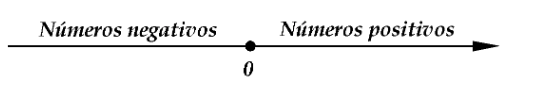
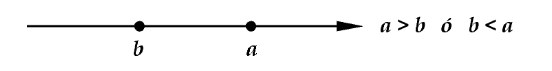

- Todo número real se puede representar gráficamente como un punto sobre una lı́nea recta, la cual llamaremos **recta real** y, recı́procamente, todo punto sobre la recta real representa un número real. Es decir, existe una correspondencia **biunı́voca** entre los elementos de ℝ y los puntos de la recta real. El punto 0 sobre la recta real es el **origen**.
- Los números **positivos** son los que están ubicados a la “derecha" de 0 en la recta real; los que están ubicados a la “izquierda" de 0 son los **negativos**.
	- 
- ### Definición $$a, b \isin \mathbb R$$
	- Decimos que a es *mayor que* b y escribimos $$a > b$$, si $a - b$ es un número **positivo**
	- Decimos que a es *menor que* b y escribimos $$a < b$$, si $a - b$ es un número **negativo**
	- La expresión 𝑎≤𝑏 es equivalente a tener 𝑎<𝑏 ó 𝑎=𝑏, y se lee “𝑎 es menor que o igual a 𝑏"
	- Intuitivamente decimos que los número reales están “ordenados", ya que si 𝑎 y 𝑏 son número reales, siempre podemos determinar si 𝑎>𝑏 ó 𝑎<𝑏 ó 𝑎=𝑏.
- Si $$a > b$$ entonces $$b < a$$. Se acostumbra a escribir $a < b < c$ que es la forma corta de la expresión $$a < b \wedge b < c$$
- Geométricamente, si 𝑎 y 𝑏 son números reales, 𝑎>𝑏 si 𝑎 está a la “derecha" de 𝑏 en la recta real. En este caso decimos también que 𝑏 es menor que 𝑎, y escribimos 𝑏<𝑎.
	- 
- #### Algunas propiedades del orden
	- Si $𝑎∈ℝ$, entonces $a^2 =a⋅a⩾0$ y $a^2=0, a = 0$
	- Sean $a, b, c, \isin \mathbb R$:
		-
-